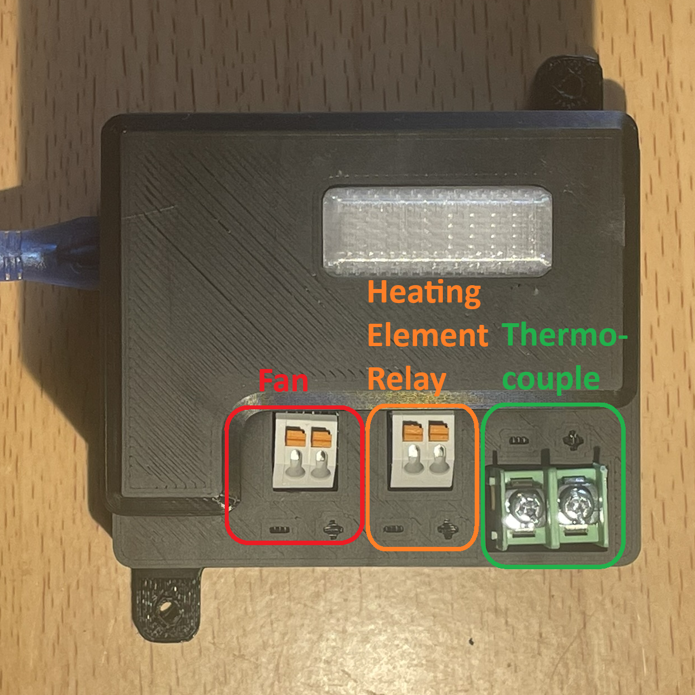

# ASOCS User Guide
## First Time Setup

1. Connect the thermocouple to the correct positions on the thermocouple termina
2. Connect the relay wires to the correct positions on the relay terminal
3. Connect the fan wires to the correct positions on the relay terminal
4. Connect the male AC plug to AC power via extension cable
5. Connect the heating element to the female AC plug
## Usage
Just plug it in and it will control the oven temperature during the control window!
## LED Indicators
- Off: The heating element is off.
- Solid Orange: The heating element is on.
- Blinking Red: An error has occured, most likely the system time was reset. Follow "Setting the time" below. If this issue persists, try replacing the battery.
- 2 Green blinks: The user defined settings were sucessfully loaded.
- 5 Red blinks: The user defined settings failed to load and the system will continue with the default settings. If this occurs, ensure SETTINGS.json is formatted correctly and the values are integers.
- Fading Purple: The device is connected to a computer and the system is idle.
## Device Settings
The following parameters can be changed to customize the behavior of the controller. All temperatures are in Celsius and the time is using a 24 hour clock. The control window is the time frame at which the system will monitor the conditions within the oven and turn on the heating element, if needed
- Temperature: This is the target temperature in celcius that the controller will control to. Default is 50C
- Start Hour: The hour component of the time that marks the beginning of the control window
- Start Minute: The minute component of the time that marks the beginning of the control window
- End Hour: The hour component of the time that marks the end of the control window
- End Minute: The minute component of the time that marks the beginning of the control window
### Changing the settings
1. Disconnect the USB A cable from the power adapter
2. Connect the USB A cable to a computer(The device will appear as a storage device)
3. Open File Explorer and open CIRCUITPYTHON
4. Open SETTINGS.json with a text editor
5. Edit the value to the right of the colon to the desired value(Be sure to not delete the comma)
6. Disconnect the USB A cable from the computer
7. Reconnect the USB A cable to the power adapter

### Setting the time
1. Complete steps 1-4 from "Changing Settings"
2. Change the value of "reset_time_hour" to the current hour
3. Change the value of "reset_time_minute" to the current minute
4. Disconnect the USB A cable from the computer
5. Connect the USB A cable to the power adapter
6. Upon startup the LEDs should blink blue 5 times indicated the time was successfully set
